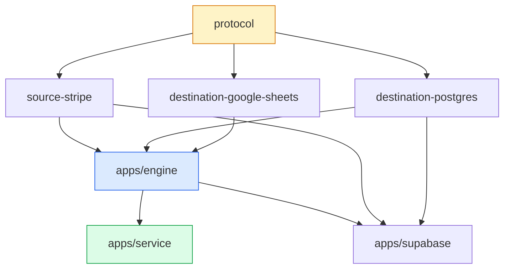
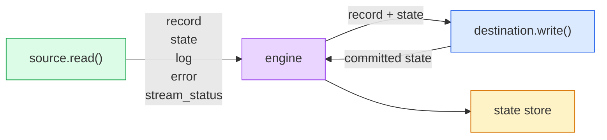
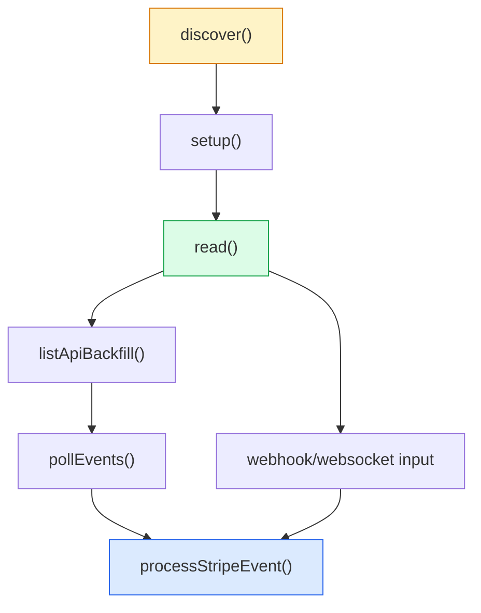
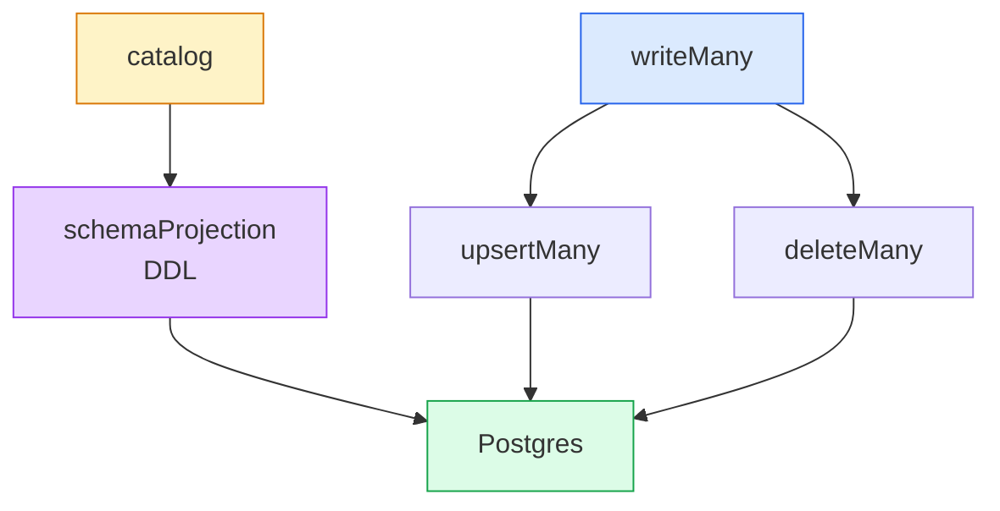
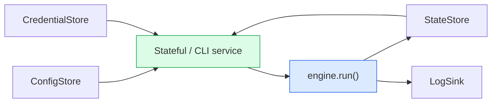

# Sync Engine Knowledge Transfer

How this codebase is structured, how a sync runs, and where changes tend to go wrong

---

## 90-minute agenda

| Time | Topic | Goal |
| --- | --- | --- |
| 0-10 | Problem + package map | Build the mental model |
| 10-25 | Architectural invariants | Learn what must not be broken |
| 25-45 | Core runtime flow | Understand how a sync actually runs |
| 45-60 | Stripe source + Postgres destination | Ground the model in concrete code |
| 60-72 | Stateful service layer | See where config, credentials, state, and logs live |
| 72-82 | Tests and safety rails | Know what catches regressions |
| 82-90 | Debugging + gotchas | Know how to recover when reality bites |

By the end, you should know where to start, what contracts matter, and what changes carry architectural risk.

---

## layout: two-cols

## The repo in one picture

```text
packages/
  protocol
  source-stripe
  destination-postgres
  destination-google-sheets
  state-postgres
  util-postgres
  ts-cli
apps/
  engine
  service
  supabase
  dashboard / visualizer
```

The fastest path to a useful mental model is:

- `docs/architecture/packages.md`
- `docs/architecture/principles.md`
- `docs/engine/ARCHITECTURE.md`
- `docs/service/overview.md`

::right::



---

## The invariants to memorize

These are the rules that define the system:

1. Message-first protocol: everything is typed async iterable messages.
2. Connector isolation: sources never import destinations, and vice versa.
3. State is a message: connectors never talk to persistence directly.
4. Snake_case on the wire: schemas and serialized payloads use snake_case.
5. Schema is discovered, not hardcoded: sources advertise streams and schemas.
6. `api_version` is required for Stripe source config.
7. Tests fail loud: infra issues should surface, not silently skip.
8. Destinations never own `_updated_at`: the source stamps it.

If one of these changes, that is an architectural change, not a routine refactor.

---

## layout: two-cols

## The message protocol

This repo is easiest to understand if you stop thinking in classes and start thinking in streams.

```ts
type Message =
  | RecordMessage
  | StateMessage
  | CatalogMessage
  | LogMessage
  | ErrorMessage
  | StreamStatusMessage
```

The engine validates the boundary between connectors using Zod schemas from `@stripe/sync-protocol`.

::right::



---

## The runtime path

This is the core data path:

```ts
pipe(
  source.read(params),
  enforceCatalog(catalog),
  log,
  filterType('record', 'state'),
  destination.write,
  persistState(store),
)
```

What matters:

- `discover()` defines the catalog and schemas before `read()` starts.
- The engine forwards only `record` and `state` to destinations.
- A `StateMessage` is a commit fence, not a side channel.
- Resume behavior is source-controlled because the source decides checkpoint granularity.

---

## layout: two-cols

## Stripe source: what matters

The Stripe source is where most of the source-specific complexity lives:

- `spec`, `check`, `discover`, `setup`, `read`, `teardown`
- `discover()` caches OpenAPI-derived catalogs by API version
- account metadata and `_account_id` enum stamping happen at discovery/setup time
- `read()` supports both one-shot backfill and live input-driven modes
- state shapes differ by flow: backfill ranges, events cursor, global cursor

The main code paths are:

- `src-list-api.ts`
- `src-events-api.ts`
- `src-webhook.ts`
- `process-event.ts`

::right::



---

## Stripe source: the two repo-specific details

Two repo-specific decisions matter more than they look:

1. `_updated_at` is source-stamped, not destination-computed.
   See DDR-009 in `docs/architecture/decisions.md`.
   The source prefers `record.updated`, otherwise falls back to event or response time.

2. Account tenancy is enforced through catalog enums.
   Discover stamps `_account_id.enum = [acct_...]`, and destinations enforce that at write time.
   See DDR-010 in `docs/architecture/decisions.md`.

These are easy to miss in a skim and expensive to break in production.

---

## layout: two-cols

## Postgres destination: what matters

The Postgres destination is the main example of how destinations stay generic while still enforcing strong guarantees:

- `setup()` applies schema from catalog
- JSON Schema drives DDL projection
- records go through `writeMany()` -> `upsertMany()` / `deleteMany()`
- `_updated_at` is validated and lifted into the destination column
- enum-backed columns become CHECK constraints

The important framing:

- destination logic is generic around protocol/catalog contracts
- destination should never need Stripe-specific knowledge

::right::



---

## Service layer: where the real deployment concerns live

The engine is intentionally pure. The service owns the messy parts:

- credentials
- config
- state persistence
- logs
- orchestration and retries

The important split is:

- stored form: `SyncConfig` with credential references
- resolved form: `SyncParams` with secrets inlined for the engine

This separation is the reason `apps/service` exists at all.

---

## layout: two-cols

## Service flow

At runtime, the service is responsible for:

- resolve config + credentials + state into engine params
- run sync and stream progress/log messages
- persist committed state checkpoints
- handle auth failures at the service layer and retry with refreshed credentials

That is why token refresh lives in the service layer instead of inside `Source.read()`.

::right::



---

## Testing: what guards what

Think about the tests by purpose, not only by command:

| Layer | Examples | What it protects |
| --- | --- | --- |
| Unit | package tests | local logic and protocol helpers |
| Architecture | `e2e/layers.test.ts` | dependency boundaries |
| Integration | package/service integration tests | Postgres and API wiring |
| End-to-end | `e2e/*.test.ts` | real pipeline behavior across packages |

Minimal operating commands:

```sh
pnpm test
pnpm test:integration
pnpm test:e2e
```

The normal pre-commit expectation is `pnpm format && pnpm lint && pnpm build`.

---

## Debugging and gotchas

The practical traps:

- The sync CLI runs the engine as a subprocess.
- Connector `console.error()` output goes to `sync-public.log`, not your terminal.
- Local CLI runs live TS source via `tsx` and the `"bun"` condition, so edits propagate without a rebuild.
- Vitest resolves `dist/`, so tests often need `pnpm build` first.
- `apps/supabase` is Deno-flavored and not a normal Node runtime path.
- Do not re-enable `injectWorkspacePackages: true`; it breaks the live-edit workflow.

Most of these are documented in `docs/guides/debugging-sync-cli.md`.

---

## Recommended reading order after the session

For a new maintainer, this is the shortest sensible deeper dive:

1. `docs/architecture/principles.md`
2. `docs/architecture/packages.md`
3. `docs/architecture/decisions.md`
4. `docs/engine/ARCHITECTURE.md`
5. `docs/service/overview.md`
6. `packages/source-stripe/src/index.ts`
7. `packages/destination-postgres/src/index.ts`
8. `e2e/layers.test.ts`

If you can explain those back clearly, you understand the codebase well enough to make safe changes.
