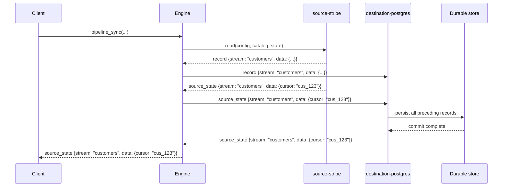
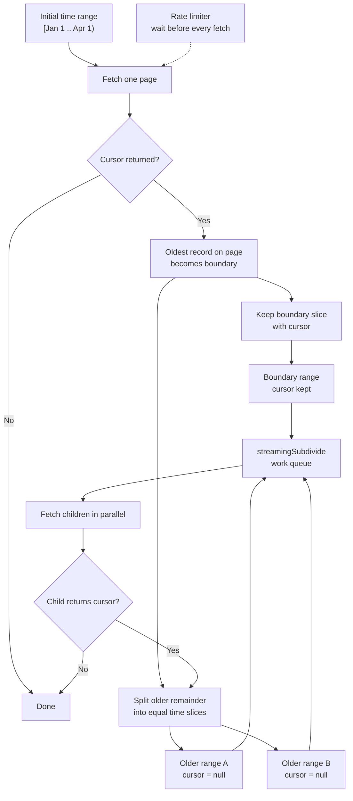
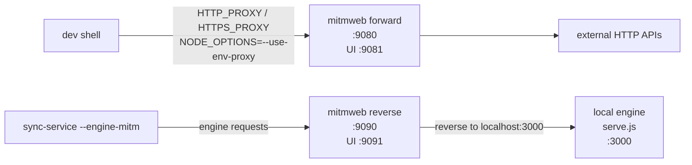

## Sync Engine

- source / destination sync runtime
- one protocol for backfill and realtime
- pluggable connectors, reusable engine

---

## sync engine is ...

- a message-driven runtime for moving data between systems
- transport agnostic
- supports both pull (iterable) and push (events)

---

## many deployment targets

- as a library
  - embed the runtime inside another product or integration surface
  - useful when the caller already owns scheduling, persistence, and API boundaries
  - examples mentioned in the outline: Replit, Supabase
  - usage example
    ```ts
    import { createEngine } from '@stripe/sync-engine'

    const engine = await createEngine(resolver)
    const eof = await engine.pipeline_sync_batch(pipeline, { run_id: 'run_demo' })
    ```
- as cli
  - easiest surface for direct users and contributors
  - good for local debugging, one-off syncs, and connector development
  - usage example
    ```sh
    npx @stripe/sync-engine \
      --stripe.api_key sk_live_xxx \
      --postgres.url postgresql://...
    ```
- docker
  - package the runtime for Kubernetes and internal Stripe deployment targets
  - makes the runtime environment consistent across machines and services
  - usage example
    ```sh
    docker run --rm -p 4010:4010 stripe/sync-engine
    ```
  - what that means
    - the engine image entrypoint is `node --use-env-proxy dist/bin/serve.js`
    - running the container starts the stateless HTTP API server by default
    - the service image is a different entrypoint (`dist/bin/sync-service.js`)

---

## Sync Message Protocol

<div class="h-[420px] overflow-y-auto pr-4">

- `record` — carries one data record for one stream
    ```json
    {"type":"record","record":{"stream":"customers","data":{"id":"cus_123","email":"a@b.com"},"emitted_at":"2026-01-01T00:00:00.000Z"}}
    ```
- `source_state` — checkpoints source progress so the sync can resume safely
    ```json
    {"type":"source_state","source_state":{"state_type":"stream","stream":"customers","data":{"cursor":"cus_123"}}}
    ```
- `catalog` — advertises available streams and their schemas
    ```json
    {"type":"catalog","catalog":{"streams":[{"name":"customers","primary_key":[["id"]],"newer_than_field":"_updated_at"}]}}
    ```
- `log` — emits diagnostics without polluting the data stream
    ```json
    {"type":"log","log":{"level":"info","message":"Fetched page 1","data":{"stream":"customers"}}}
    ```
- `spec` — returns connector configuration and state/input schemas
    ```json
    {"type":"spec","spec":{"config":{"type":"object","properties":{"api_key":{"type":"string"}}},"source_state_stream":{"type":"object"},"source_input":{"type":"object"}}}
    ```
- `connection_status` — reports whether a connector check succeeded or failed
    ```json
    {"type":"connection_status","connection_status":{"status":"failed","message":"invalid api key"}}
    ```
- `stream_status` — reports per-stream lifecycle and liveness
    ```json
    {"type":"stream_status","stream_status":{"stream":"customers","status":"complete"}}
    ```
- `control` — lets a connector ask the orchestrator to replace config
    ```json
    {"type":"control","control":{"control_type":"destination_config","destination_config":{"spreadsheet_title":"Stripe export","spreadsheet_id":"sheet_123","access_token":"ya29.a0AfH6SMAExampleAccessToken","refresh_token":"1//0gExampleRefreshToken"}}}
    ```
    ```json
    {"type":"control","control":{"control_type":"source_config","source_config":{"api_version":"2025-04-30.basil","webhook_url":"https://example.com/webhooks/pipe_123","webhook_secret":"whsec_123"}}}
    ```
- `progress` — engine-emitted full progress snapshot for the current run
    ```json
    {"type":"progress","progress":{"started_at":"2026-01-01T00:00:00.000Z","elapsed_ms":1200,"global_state_count":2,"derived":{"status":"started","records_per_second":80,"states_per_second":2,"total_record_count":96,"total_state_count":2},"streams":{"customers":{"status":"started","state_count":2,"record_count":96}}}}
    ```

</div>

---

## 3 components and their roles

<div class="grid grid-cols-3 gap-6 pt-6">
  <div class="rounded-xl border border-green-300 bg-green-50 p-5">
    <h3 class="m-0 text-lg font-semibold">Source</h3>
    <p class="mt-3 text-sm leading-6">
      Reads from an upstream system and emits protocol messages.
    </p>
  </div>
  <div class="rounded-xl border border-violet-300 bg-violet-50 p-5">
    <h3 class="m-0 text-lg font-semibold">Engine</h3>
    <p class="mt-3 text-sm leading-6">
      Composes source and destination into a sync run and handles routing,
      limits, and orchestration surfaces.
    </p>
  </div>
  <div class="rounded-xl border border-blue-300 bg-blue-50 p-5">
    <h3 class="m-0 text-lg font-semibold">Destination</h3>
    <p class="mt-3 text-sm leading-6">
      Consumes messages and writes durably into a downstream system.
    </p>
  </div>
</div>

---

## source interface

```ts
export interface Source {
  spec(): AsyncIterable<SpecMessage | LogMessage>
  check(
    params: { config: TConfig }
  ): AsyncIterable<ConnectionStatusMessage | LogMessage>
  discover(
    params: { config: TConfig }
  ): AsyncIterable<CatalogMessage | LogMessage>
  read(
    params: {
      config: TConfig
      catalog: ConfiguredCatalog
      state?: { streams: Record<string, TSourceState>; global: Record<string, unknown> }
    },
    $stdin?: AsyncIterable<TInput>
  ): AsyncIterable<Message>
  setup?(params: {
    config: TConfig
    catalog: ConfiguredCatalog
  }): AsyncIterable<ControlMessage | LogMessage>
  teardown?(params: {
    config: TConfig
  }): AsyncIterable<LogMessage>
}
```

---

## destination interface

```ts
export interface Destination {
  spec(): AsyncIterable<SpecMessage | LogMessage>
  check(
    params: { config: TConfig }
  ): AsyncIterable<ConnectionStatusMessage | LogMessage>
  write(
    params: {
      config: TConfig
      catalog: ConfiguredCatalog
    },
    $stdin: AsyncIterable<DestinationInput>
  ): AsyncIterable<DestinationOutput>
  setup?(params: {
    config: TConfig
    catalog: ConfiguredCatalog
  }): AsyncIterable<ControlMessage | LogMessage>
  teardown?(params: {
    config: TConfig
  }): AsyncIterable<LogMessage>
}
```

---

## engine interface

```ts
export interface Engine {
  source_discover(source: PipelineConfig['source']): AsyncIterable<CatalogMessage | LogMessage>
  pipeline_setup(
    pipeline: PipelineConfig,
    opts?: { only?: 'source' | 'destination' }
  ): AsyncIterable<ControlMessage | LogMessage>
  pipeline_teardown(
    pipeline: PipelineConfig,
    opts?: { only?: 'source' | 'destination' }
  ): AsyncIterable<LogMessage>
  pipeline_sync_batch(
    pipeline: PipelineConfig,
    opts?: BatchSyncOptions
  ): Promise<EofPayload>
}
```

Example output: `source_discover`

```json
{"type":"catalog","catalog":{"streams":[{"name":"customer","primary_key":[["id"]],"newer_than_field":"_updated_at"}]}}
```

Example output: `pipeline_setup`

```json
{"type":"log","log":{"level":"info","message":"Starting pipeline setup","data":{"source_type":"stripe","destination_type":"postgres","run_source":true,"run_destination":true}}}
{"type":"control","control":{"control_type":"source_config","source_config":{"api_key":"sk_test_...","api_version":"2025-04-30.basil","account_id":"acct_test_123","account_created":1700000000}}}
```

Example output: `pipeline_teardown`

```json
{"type":"log","log":{"level":"info","message":"Tearing down destination resources","data":{"destination_type":"postgres"}}}
```

Example output: `pipeline_sync_batch`

```json
{
  "status": "succeeded",
  "has_more": true,
  "ending_state": {
    "source": { "streams": { "customer": { "cursor": "2" } }, "global": {} },
    "destination": {},
    "sync_run": { "run_id": "run_batch" }
  },
  "run_progress": { "derived": { "status": "started" }, "streams": {} },
  "request_progress": { "derived": { "status": "started" }, "streams": {} }
}
```

---

## source_state re-emit sequence



`source_state` is a commit fence: destination re-emits the same payload only after preceding writes are durable.

---

## transport agnostic

- in-memory
  - direct async iterable composition
  - simplest path for tests and library usage
- stdin / out
  - NDJSON over stdout/stdin for subprocess execution
  - keeps connectors language-agnostic and process-isolated
- http
  - remote execution surface for engine and service APIs
  - useful when orchestration and execution live in separate processes

---

## dummy source & destination, simply using the file system

- let's try it out. echo source | cat destination
  ```bash
  ./demo/dummy-source.sh | cat
  ```
- now add the engine in there, and we get to keep track of the progress of sync
  - the engine adds validation, routing, catalog enforcement, and checkpoint handling
  - this is where “pipe some data” becomes “run a sync safely”

---

## source-stripe

- `discover`
  - OpenAPI-driven and cached by API version
  - stamps account-specific catalog details such as `_account_id` enum constraints
- `setup`
  - resolves account metadata
  - creates or reuses managed webhook configuration
- `read`
  - supports both backfill and event-driven flows
  - emits records, checkpoints, logs, and stream status events
- `rate limits`
  - every list API page fetch goes through `withRateLimit(listFn, rateLimiter)`
  - default token bucket is `config.rate_limit ?? (liveMode ? 50 : 10)` requests/sec
  - HTTP retries are separate: `429`, `5xx`, and retryable network errors back off and honor `Retry-After`

---
layout: two-cols
---

## source-stripe: binary subdivision

<div class="binary-subdivision-copy">

- only used when the Stripe endpoint supports created-time filtering
- oldest record on the fetched page becomes the boundary
- boundary slice keeps the cursor
- older remainder is split into equal time slices with `cursor = null`
- `streamingSubdivide` runs child ranges as a concurrent work queue
- if a child still has more data, split again
- if created filters are unsupported, fall back to sequential pagination
- density intuition:
  ```text
  [Jan ------------------------------- Apr)
  sparse     sparse     dense dense dense
                           ^
                        boundary
  ```

</div>

::right::

<div class="binary-subdivision-diagram">



</div>

---

## destination-postgres

- `setup`
  - projects schema from the discovered catalog
  - does not need hardcoded table definitions
- `write`
  - flows through upsert and delete paths
  - enforces staleness gating and enum constraints at the database boundary
- important point
  - behavior stays generic
  - it relies on the protocol contract, the catalog, and source-stamped fields such as `_updated_at`

---

## role of the engine

- concept of a single sync run
  - one bounded attempt to move state forward
  - includes params, current checkpoint state, and a resulting output stream
  - may stop at a safe continuation boundary instead of exhausting the source
- progress tracking
  - progress comes from state, stream status, logs, and terminal output
  - orchestration can only make good decisions if liveness is explicit

---

## source-stripe | destination-postgres

- main production-shaped path in the repo
- Stripe source discovers streams and emits source-owned state
- Postgres destination projects schema and applies durable writes
- engine and service glue the two into resumable sync behavior

---

## Putting it all together: backfill

```ts
pipelineBackfill(pipelineId, { syncState }) {
  while (true) {
    result = backfillStep({ pipelineSync }, pipelineId, {
      syncState,
    })

    syncState = result.syncState

    if (!result.eof.has_more) {
      return result.eof
    }
  }
}
```

---

## Putting it all together: webhook real time

```ts
POST /webhooks/{pipeline_id} {
  verifyStripeSignature(body, headers)
  pipeline = pipelineStore.get(pipeline_id)
  engine = createRemoteEngine(...) or createEngine(...)

  output = POST /pipeline_handle_events {
    pipeline: {
      source: pipeline.source,
      destination: pipeline.destination,
      streams: pipeline.streams,
    },
    stdin: [verifiedEvent]
  }

  return ndjsonResponse(output)
}
```

---

## developer workflow

- forward proxy
  - `source scripts/mitmweb-forward-proxy.sh`
  - starts proxy on `127.0.0.1:9080`, UI on `127.0.0.1:9081`
  - exports `HTTP_PROXY` / `HTTPS_PROXY`
  - adds `NODE_OPTIONS=--use-env-proxy` because Node fetch otherwise bypasses the proxy
- reverse proxy
  - `scripts/mitmweb-reverse-proxy.sh http://localhost:3000`
  - starts proxy on `127.0.0.1:9090`, UI on `127.0.0.1:9091`
  - forwards traffic to a local engine listening on `:3000`
- `--engine-mitm`
  - `sync-service --engine-mitm` starts a local engine on `:3000`
  - the service then points its engine traffic at `http://127.0.0.1:9090`
  - this lets you inspect service → engine requests in the reverse proxy UI



---

## Experimental

- When we started the sync engine, the vision is to become an ubiquitous utility to help user “get your data where you need it, in real time, with a consistent schema”
  - long-term direction is broader than one Stripe-to-Postgres path
  - the bet is that one protocol can support many connector pairs
- https://docs.google.com/document/d/1S4ELi0jZfCWupoi1m8iS49XmecPHgLOapi0xojtRDeM/edit?tab=t.0#heading=h.ihr1ujskb3dc
  - broader product and vision context
  - useful if you want the “why now / where next” story

---

## source-metronome | destination-redis

- single seconds data sync latency
  - goal is near-real-time movement into a fast serving layer
  - pressures orchestration overhead, batching, and transport choices
- single ms query latency without relying on the internet
  - downstream shape can optimize for local low-latency reads
  - shows the architecture is not limited to warehouse-style sinks

---

## source-postgres | destination-stripe

- Sync both standard AND custom objects into Stripe
  - shows the architecture can also support reverse sync paths
  - destination semantics matter as much as source semantics here
- standard
  - customer
    - canonical standard object example
  - products
    - another standard object with a different lifecycle and shape
- custom
  - locations
    - example tenant-specific entity
  - devices
    - another custom entity showing the pattern is reusable
