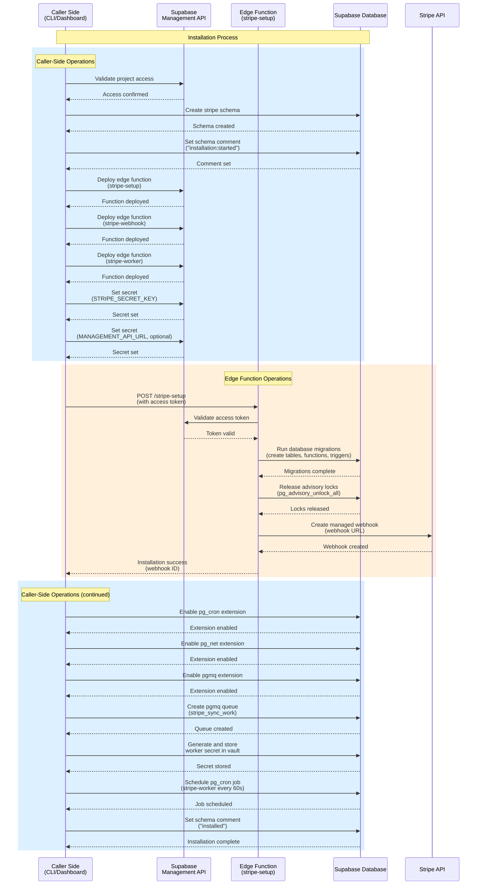
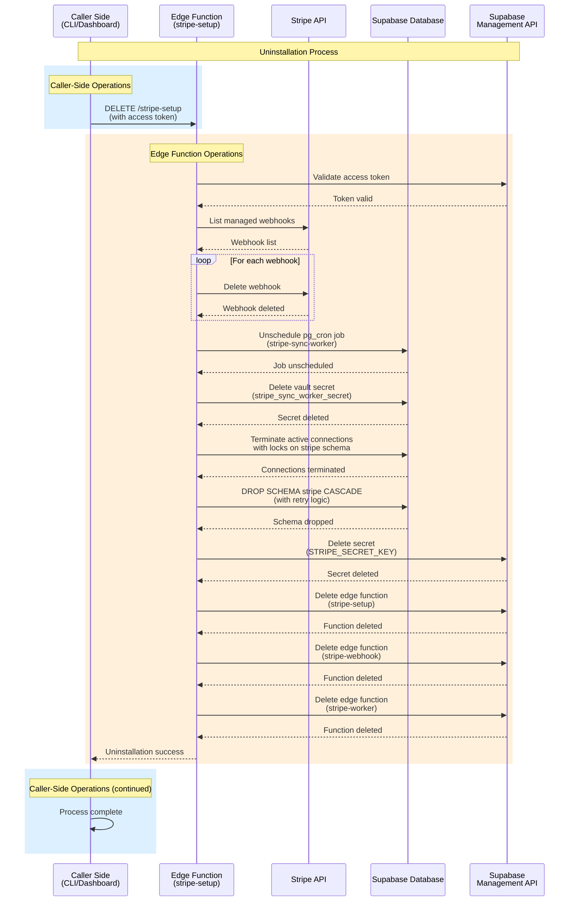
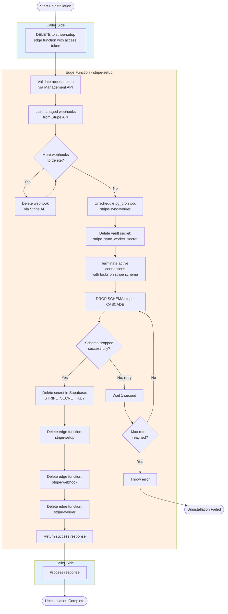

# Supabase Installation and Uninstallation Diagrams

## Installation Process

### Installation Flow Diagram

### Installation Flowchart

```mermaid
flowchart TD
    Start([Start Installation]) --> ValidateProject

    subgraph CallerSide1[" Caller Side - Setup Phase "]
        ValidateProject[Validate Project Access<br/>via Management API]
        ValidateProject --> CreateSchema[Create stripe schema<br/>in Supabase DB]
        CreateSchema --> SetStarted[Set schema comment:<br/>'installation:started']
        SetStarted --> DeploySetup[Deploy edge function:<br/>stripe-setup]
        DeploySetup --> DeployWebhook[Deploy edge function:<br/>stripe-webhook]
        DeployWebhook --> DeployWorker[Deploy edge function:<br/>stripe-worker]
        DeployWorker --> SetStripeSecret[Set secret in Supabase:<br/>STRIPE_SECRET_KEY]
        SetStripeSecret --> SetMgmtUrl{MANAGEMENT_API_URL<br/>needed?}
        SetMgmtUrl -->|Yes| SetMgmtSecret[Set secret in Supabase:<br/>MANAGEMENT_API_URL]
        SetMgmtUrl -->|No| InvokeSetup
        SetMgmtSecret --> InvokeSetup[POST to stripe-setup<br/>edge function]
    end

    subgraph EdgeFunction[" Edge Function - stripe-setup "]
        InvokeSetup --> ValidateToken[Validate access token<br/>via Management API]
        ValidateToken --> RunMigrations[Run database migrations:<br/>tables, functions, triggers]
        RunMigrations --> ReleaseLocks[Release advisory locks:<br/>pg_advisory_unlock_all]
        ReleaseLocks --> CreateWebhook[Create Stripe webhook<br/>via Stripe API]
        CreateWebhook --> ReturnSuccess[Return success response<br/>with webhook ID]
    end

    subgraph CallerSide2[" Caller Side - Worker Setup "]
        ReturnSuccess --> EnableCron[Enable pg_cron extension]
        EnableCron --> EnableNet[Enable pg_net extension]
        EnableNet --> EnablePgmq[Enable pgmq extension]
        EnablePgmq --> CreateQueue[Create pgmq queue:<br/>stripe_sync_work]
        CreateQueue --> GenSecret[Generate unique worker secret]
        GenSecret --> StoreSecret[Store secret in vault:<br/>stripe_sync_worker_secret]
        StoreSecret --> ScheduleJob[Schedule pg_cron job:<br/>invoke stripe-worker every 60s]
        ScheduleJob --> SetInstalled[Set schema comment:<br/>'installed']
    end

    SetInstalled --> End([Installation Complete])

    style CallerSide1 fill:#e1f0ff
    style CallerSide2 fill:#e1f0ff
    style EdgeFunction fill:#fff0e1
```

## Uninstallation Process

### Uninstallation Flow Diagram

### Uninstallation Flowchart

## Key Boundaries

### Caller Side Responsibilities
- Validate project access
- Create initial database schema
- Deploy edge functions
- Set secrets (STRIPE_SECRET_KEY, MANAGEMENT_API_URL)
- Configure scheduled worker (pg_cron setup)
- Track installation status via schema comments

### Edge Function (stripe-setup) Responsibilities
- Validate access tokens via Management API
- Run database migrations (tables, functions, triggers)
- Manage Stripe webhooks (create/delete)
- Clean up database resources (drop schema, terminate connections)
- Delete secrets and edge functions during uninstall

### Security Notes
- All edge function invocations require access token validation
- Worker secret stored in Supabase vault for authentication
- Stripe secret key stored as Supabase secret, not in database
- Edge functions use internal database URL for privileged operations
